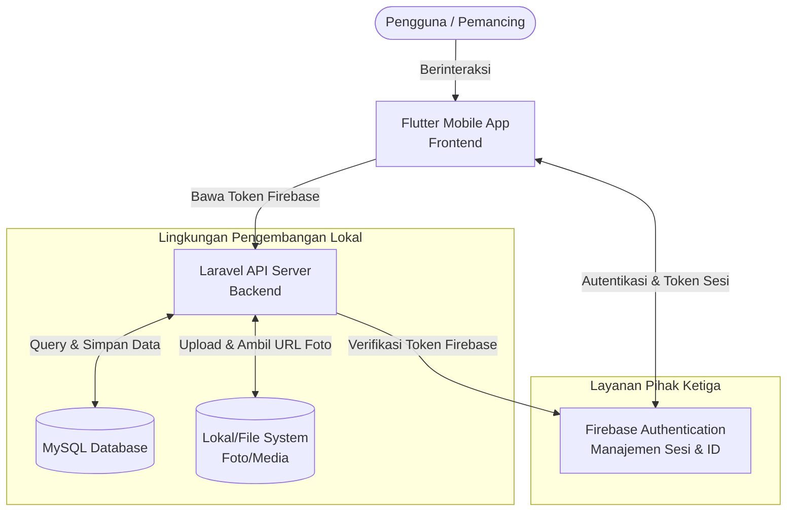
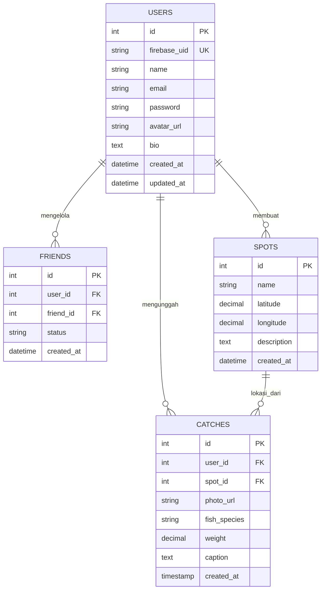

# PRD — Project Requirements Document

## 1. Overview
Banyak orang yang hobi memancing merasa kesulitan karena tidak ada platform khusus untuk membagikan pengalaman, memperlihatkan hasil tangkapan, dan bertukar informasi mengenai spot memancing yang bagus. 

Aplikasi ini adalah media sosial khusus untuk para pemancing (anglers) yang bertujuan untuk memecahkan masalah tersebut. Melalui aplikasi ini, pengguna dapat merasakan interaksi yang menyenangkan semenjak pertama kali menggunakan aplikasi dengan melihat foto-foto hasil tangkapan pengguna lain. Tujuan utama aplikasi ini adalah menjadi tempat berkumpulnya komunitas pancing digital di mana mereka bisa pamer hasil tangkapan (sebagai alasan utama untuk terus kembali menggunakan aplikasi) dan saling berbagi informasi spot terbaru yang menjanjikan. Proyek ini dirancang khusus untuk memenuhi kebutuhan tugas mata kuliah dengan ruang lingkup pengembangan berfokus pada fungsi inti tanpa memerlukan infrastruktur deployment skala produksi. Autentikasi pengguna akan ditangani secara aman dan real-time menggunakan Firebase, sementara seluruh logika bisnis dan penyimpanan data utama tetap berjalan di lingkungan lokal.

## 2. Requirements
- **Platform Mobile:** Aplikasi harus dikembangkan sebagai aplikasi seluler (Android dan iOS) agar dapat digunakan dengan mudah saat pengguna sedang berada di luar ruangan (spot memancing).
- **Layanan Berbasis Lokasi (GPS):** Kemampuan untuk menandai (tag) dan mencari titik koordinat spot memancing.
- **Manajemen Media:** Sistem yang stabil untuk mengunggah, menyimpan, dan menampilkan foto ikan hasil tangkapan dengan cepat.
- **Interaksi Sosial:** Sistem pertemanan, pengikut (followers), dan interaksi dasar (likes, komentar) untuk membangun komunitas.
- **Autentikasi Firebase:** Menggunakan Firebase Authentication sebagai sistem otorisasi utama untuk registrasi, login manajemen sesi, dan verifikasi keamanan pengguna secara real-time tanpa perlu membangun stack autentikasi mandiri di backend.
- **Performa & Lingkungan Pengembangan:** Backend dan database akan dijalankan dalam lingkungan pengembangan lokal (localhost) untuk keperluan pembuatan dan pengujian tugas kuliah tanpa memerlukan konfigurasi deployment atau scaling cloud. Firebase hanya digunakan untuk layanan autentikasi, bukan untuk hosting database atau storage utama.

## 3. Core Features
Fitur-fitur berikut dirancang untuk memenuhi ruang lingkup tugas kuliah dan dapat diuji sepenuhnya dalam lingkungan jaringan lokal atau simulasi perangkat:
- **Upload Foto Ikan & Catat Hasil Tangkapan:** Fitur utama bagi pengguna untuk mendokumentasikan hasil pancingan mereka (jenis ikan, berat, umpan yang digunakan) lalu mengunggahnya untuk "dipamerkan" ke komunitas.
- **Feed "Pamer Tangkapan":** Halaman beranda yang menampilkan *timeline* atau *feed* dari pengguna lain, memungkinkan pengguna baru mendapatkan nilai langsung (*first win*) dengan melihat foto-foto tangkapan yang mengesankan.
- **Bagikan & Eksplorasi Lokasi Spot:** Peta interaktif atau daftar lokasi di mana pengguna dapat melihat spot memancing terbaru di sekitar mereka, atau membagikan spot rahasia mereka sendiri.
- **Cari Teman Memancing:** Fitur untuk mencari pengguna lain berdasarkan lokasi area terdekat atau minat teknik memancing yang sama, guna merencanakan jadwal memancing bersama.
- **Login & Registrasi Aman:** Pengelolaan akun pengguna secara otomatis terenkripsi dan tersinkronisasi melalui Firebase Authentication, memungkinkan login cepat dengan email/sandi atau metode lain yang didukung Firebase.
- **Manajemen Profil Pengguna:** Fitur yang memungkinkan pengguna mengelola identitas digital mereka secara mandiri, termasuk mengunggah atau memperbarui foto profil, menambahkan atau mengedit bio pribadi, memperbarui username display, serta mengubah kredensial keamanan (password atau email) yang diverifikasi secara langsung melalui Firebase Authentication sebelum disinkronkan ke backend lokal.

## 4. User Flow
1. **Registrasi & Onboarding:** Pengguna baru mendaftar atau login melalui Firebase Authentication. Setelah sesi aktif, pengguna diarahkan untuk mengisi profil dasar, mengunggah avatar, dan memilih lokasi/domisili atau jenis memancing favorit (laut, sungai, danau).
2. **Eksplorasi Feed (Beranda):** Pengguna langsung disuguhkan dengan *feed* foto-foto hasil tangkapan ikan dari orang-orang di sekitar atau akun yang sedang diikuti.
3. **Mencatat Tangkapan Baru:** Pengguna memancing, mendapatkan ikan, lalu membuka aplikasi. Pengguna menekan tombol "Tambah Tangkapan", mengambil/mengunggah foto ikan, memasukkan detail (berat, jenis ikan), dan menandai (tag) spot lokasinya. Token sesi Firebase disertakan dalam permintaan API untuk validasi identitas.
4. **Mencari Spot Memancing:** Pengguna membuka menu "Peta/Spot", melihat penanda (pin) di peta untuk spot terbaru yang baru saja dibagikan pengguna lain, dan menyimpan atau menambahkannya ke daftar favorit.
5. **Interaksi Sosial:** Pengguna melihat profil pemancing lain di area spot tersebut atau di dalam feed, lalu mengirim pesan atau permintaan pertemanan untuk berdiskusi atau merencanakan jadwal memancing bareng.
6. **Manajemen & Pengaturan Profil:** Pengguna mengakses halaman profil pribadi untuk melihat ringkasan aktivitas, memperbarui informasi akun seperti username dan bio, mengganti foto profil, serta mengelola keamanan akun. Perubahan password atau email akan diarahkan ke flow autentikasi Firebase untuk verifikasi keamanan real-time sebelum data profil diperbarui di database lokal.

## 5. Architecture
Aplikasi ini akan menggunakan arsitektur *Client-Server* standar dalam lingkungan pengembangan lokal, dengan integrasi sisi-klien untuk layanan autentikasi pihak ketiga. Client (aplikasi mobile) akan berkomunikasi dengan Firebase Authentication terlebih dahulu untuk mendapatkan token identitas. Setelah berhasil login, aplikasi mobile mengirimkan token tersebut bersama setiap permintaan REST API ke Laravel Backend. Backend kemudian memverifikasi token Firebase sebelum memproses data bisnis dan menyimpan informasi ke database lokal. Seluruh infrastruktur pengujian dan penyimpanan media akan difasilitasi melalui server lokal untuk keperluan tugas kuliah.

## 6. Database Schema
Berikut adalah rancangan tabel database tingkat tinggi yang dibutuhkan untuk menjalankan fitur-fitur di atas. Kolom `firebase_uid` ditambahkan untuk mencocokkan identitas pengguna Firebase dengan data internal aplikasi, sementara kolom tambahan seperti `bio` dan `avatar_url` mendukung fitur manajemen profil yang komprehensif.

**Daftar Tabel & Kolom:**

*   **users:** Mengelola data pengguna.
    *   `id` (INT) - Primary key.
    *   `firebase_uid` (VARCHAR) - ID unik dari Firebase Authentication.
    *   `name` (VARCHAR) - Nama pengguna/display name.
    *   `email` (VARCHAR) - Email untuk login (disinkronkan dari Firebase).
    *   `password` (VARCHAR) - Kata sandi (hashed, opsional karena kredensial utama dikelola oleh Firebase).
    *   `avatar_url` (VARCHAR) - URL foto profil pengguna.
    *   `bio` (TEXT) - Deskripsi singkat atau profil diri pengguna.
    *   `created_at` (TIMESTAMP) - Waktu registrasi.
    *   `updated_at` (TIMESTAMP) - Waktu pembaruan profil terakhir.
*   **spots:** Menyimpan informasi lokasi memancing.
    *   `id` (INT) - Primary key.
    *   `name` (VARCHAR) - Nama atau sebutan spot.
    *   `latitude` (DECIMAL) - Koordinat garis lintang.
    *   `longitude` (DECIMAL) - Koordinat garis bujur.
    *   `description` (TEXT) - Info tambahan spot.
    *   `created_at` (TIMESTAMP) - Waktu spot dibuat.
*   **catches (tangkapan):** Menyimpan setiap *post* hasil tangkapan yang dipamerkan.
    *   `id` (INT) - Primary key.
    *   `user_id` (INT) - Foreign key ke tabel users.
    *   `spot_id` (INT) - (Bisa Null) Foreign key ke tabel spots.
    *   `photo_url` (VARCHAR) - Link foto gambar ikan.
    *   `fish_species` (VARCHAR) - Jenis ikan.
    *   `weight` (DECIMAL) - Berat ikan.
    *   `caption` (TEXT) - Cerita atau deskripsi tangkapan.
    *   `created_at` (TIMESTAMP) - Waktu posting.
*   **friends (pertemanan):** Menghubungkan sesama pemancing.
    *   `id` (INT) - Primary key.
    *   `user_id` (INT) - Pengguna yang mengikuti/mengirim permintaan.
    *   `friend_id` (INT) - Pengguna yang diikuti/ditemani.
    *   `status` (VARCHAR) - Status pertemanan (pending/accepted/blocked).
    *   `created_at` (TIMESTAMP) - Waktu permintaan dikirim.

**Diagram Relasi Entitas (ERD):**

## 7. Tech Stack
Berdasarkan kebutuhan platform dan ruang lingkup tugas kuliah, berikut adalah tumpukan teknologi (tech stack) yang digunakan:

- **Frontend:** Flutter (Dart) — Memungkinkan pembuatan aplikasi native untuk Android dan iOS dari satu basis kode (cross-platform), sangat cocok untuk aplikasi interaktif media sosial yang membutuhkan responsivitas tinggi di lapangan dan manajemen UI/UX yang fleksibel untuk halaman profil, feed, dan peta.
- **Backend:** Laravel (PHP) — Framework yang kuat dan populer, ideal untuk membangun RESTful API secara cepat dengan manajemen routing, validasi data, dan logika bisnis yang terstruktur. Berfungsi sebagai pengelola data utama, media storage lokal, dan verifikasi token autentikasi.
- **Database:** MySQL — Sistem manajemen database relasional yang stabil dan teruji untuk menyimpan data user, post, spot, relasi sosial, dan konfigurasi profil secara lokal.
- **Autentikasi:** Firebase Authentication — Layanan otorisasi pihak ketiga yang terintegrasi langsung dengan Flutter untuk mengelola login, registrasi, dan sesi pengguna secara aman dan real-time. Selain itu, Firebase SDK menyediakan fitur manajemen kredensial bawaan (seperti pengubahan password, verifikasi email, atau pembaruan profile display) yang diverifikasi di sisi klien sebelum disinkronkan ke backend lokal, menghilangkan kebutuhan untuk membangun sistem autentikasi mandiri di Laravel.
- **Deployment & Lingkungan Pengembangan:** Localhost menggunakan XAMPP atau Laragon — Digunakan untuk menjalankan server backend Laravel, database MySQL, dan penyimpanan media secara lokal guna keperluan pengembangan, pengujian, dan pengumpulan tugas kuliah tanpa konfigurasi deployment cloud. Firebase hanya diakses melalui SDK client-side dan validasi backend standar tanpa memerlukan setup server tambahan.